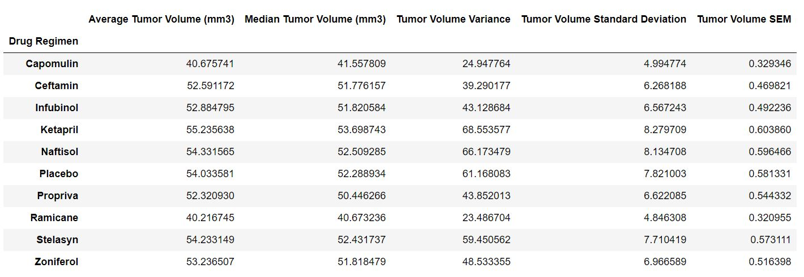
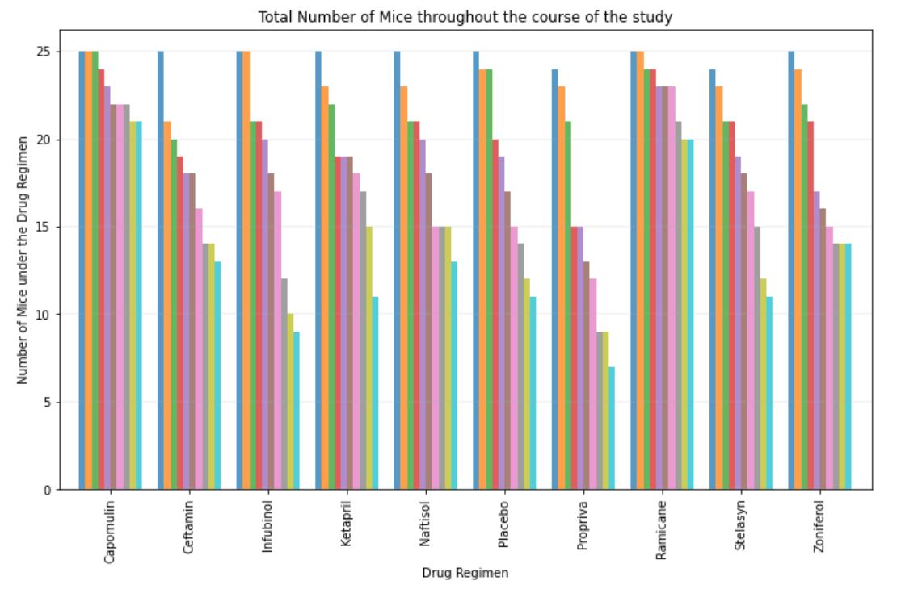
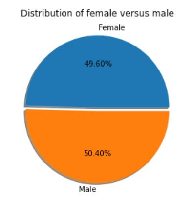
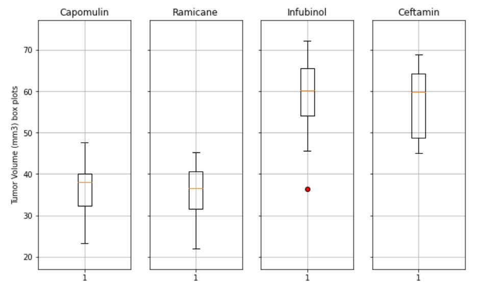
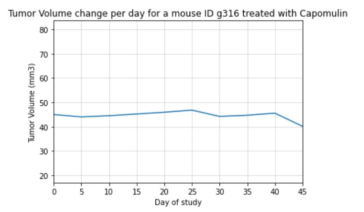
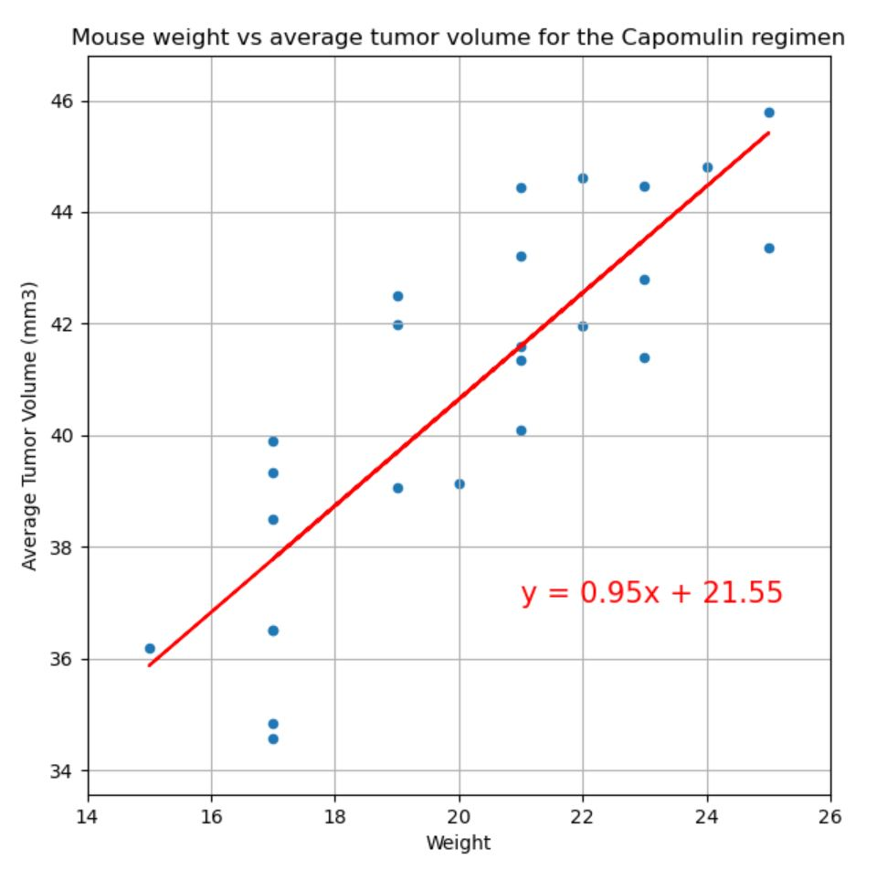

# Anti-cancer Pharmaceuticals analysis with Matplotlib
Matplotlib project for Monash Data Analytics Boot Camp

The purpose of this project was to analyse the anti-cancer treatment study data for the fictitious pharmaceutical company Pymaceuticals Inc. In this study, 249 mice identified with SCC tumor growth were treated through a variety of drug regimens. Over the course of 45 days, tumor development was observed and measured. The purpose of this study was to compare the performance of Pymaceuticals' drug of interest, Capomulin, versus the other treatment regimens.

# Data

There are two key sources of data used:

* [Mouse_metadata.csv](HeroesOfPymoli/Resources//purchase_data.csv) - .csv dataset containing mice data

* [Study_results.csv](HeroesOfPymoli/Resources//purchase_data.csv) - .csv dataset containing study results data

# Analysis

* Remove duplicates

* Generate a summary statistics table consisting of the mean, median, variance, standard deviation, and SEM of the tumor volume for each drug regimen

* Generate a bar plot that shows  the number of total mice for each treatment regimen throughout the course of the study

* Generate a pie plot that shows the distribution of female or male mice in the study.

* Calculate the final tumor volume of each mouse across four of the most promising treatment regimens: Capomulin, Ramicane, Infubinol, and Ceftamin; Calculate the quartiles and IQR and quantitatively determine if there are any potential outliers across all four treatment regimens

* Generate a box and whisker plot of the final tumor volume for all four treatment regimens and highlight any potential outliers in the plot

* Select a mouse that was treated with Capomulin and generate a line plot of tumor volume vs. time point for that mouse.

* Generate a scatter plot of mouse weight versus average tumor volume for the Capomulin treatment regimen.

* Calculate the correlation coefficient and linear regression model between mouse weight and average tumor volume for the Capomulin treatment. Plot the linear regression model on top of the previous scatter plot.

## Observations and Insights
* There is a strong correlation between the mouse weight and the average tumor volume in the group of mice treated with Capomulin - r value is 0.84. This could be further investigated for other drug regimens and the entire mice dataset, in order to determine if this trend is global, or if it is related to a drug.

* Overall number of female and male mice is nearly equal, which could mean that the test mice group is a good representation of the population. However, more detailed investigation would be required in order to draw conclusions in regards to the effectiveness of each drug on males/females, because it's possible that some drug regimens have been tested on one sex only.

* UThe two most promising drugs are Capomulin and Ramicane, with Ramicane having slightly better results. They have the lowest Average and Median Tumor Volume, along with the lowest Tumor Volume Variance and SEM. Additionally it's worth noting that both of these drugs have the highest number of Tumor Volume measurements taken, which can potentially suggest the high percentage of mice under these drug regimens survived until the end of the test. However, this conclusion cannot be taken as a fact because the dataset does not say why Tumor Volume measurements for some of the mice have been taken for less than 45 days. It could mean that these mice didn't survive, but there could also be other independent reasons.

# Demo

To run the example locally run `pymaceuticals_starter.ipynb` file in Jupyter Notebook.

# Used Tools
 * Jupyter Notebook 
 * Pandas
 * Matplotlib
